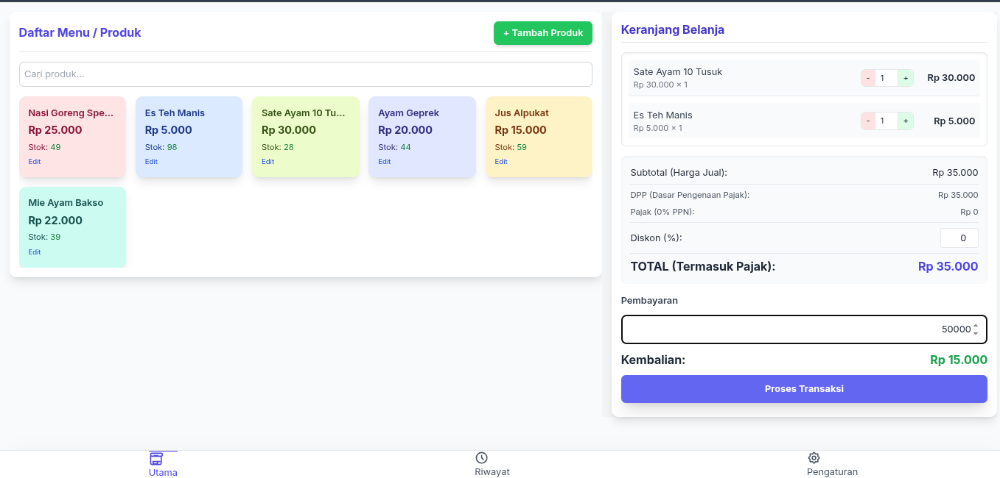
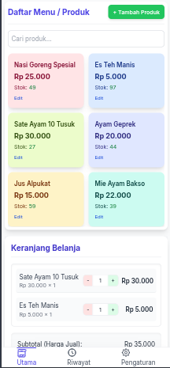

# POS - Aplikasi Kasir Offline (Web)

  

> **Aplikasi Point of Sale (POS) berbasis web, 100% offline, tanpa server, tanpa login.**  
> Cocok untuk warung makan, toko kelontong, kafe kecil, atau UMKM.

---

## Fitur Utama

| Fitur | Keterangan |
|------|------------|
| **Tambah/Edit/Hapus Produk** | Stok otomatis berkurang saat transaksi |
| **Keranjang Belanja** | Tambah/kurang item, input manual |
| **Diskon (%) & Pajak Inklusif (PPN)** | DPP & PPN otomatis dihitung |
| **Kembalian Otomatis** | Input pembayaran → kembalian langsung muncul |
| **Cetak Struk Thermal 58mm** | Pratinjau + print langsung |
| **Riwayat Transaksi + Filter** | Cari berdasarkan ID, produk, atau tanggal |
| **Pengaturan Struk** | Header, footer, nama kasir |
| **Ekspor/Impor Data (JSON)** | Backup & restore lengkap |
| **Log Aktivitas User** | Audit: transaksi, edit produk, hapus |
| **PIN untuk Aksi Kritis** | Hapus transaksi & log perlu PIN `4567` |
| **Mobile-First + Bottom Navigation** | Nyaman di HP/tablet |

---

## Screenshot

| # | Tampilan |
|---|---------|
| 1 | **Tampilan Utama**   |
| 2 | **Keranjang & Pembayaran**  |
| 3 | **Pratinjau & Cetak Struk**  |
| 4 | **Riwayat Transaksi**  |

> *Screenshot diambil dari perangkat mobile (375px).*

---

## Cara Pakai

1. **Buka file `index.html` di browser** (Chrome/Firefox/Edge)
2. Tidak perlu install, tidak perlu internet
3. Semua data disimpan di **browser Anda** via **IndexedDB**

> **Backup rutin**: Gunakan tombol **"Ekspor Semua Data"** di tab **Pengaturan**

---

## Teknologi

- **HTML5 + Tailwind CSS** → UI responsif & modern
- **Vanilla JavaScript** → Ringan, tanpa framework
- **IndexedDB** → Penyimpanan lokal tahan lama
- **Print CSS** → Struk thermal 58mm (2.25 inch)

---

## Keamanan & Audit

- Semua aksi penting **dicatat** di log
- Hapus transaksi/log **butuh PIN `4567`**
- Data **tidak pernah keluar browser**

---

## Cocok Untuk

- Warung makan
- Kafe kecil
- Toko kelontong
- Pedagang kaki lima
- UMKM tanpa server

---

## Kontribusi

Silakan fork & buat pull request!  
Ide fitur baru sangat diterima.

---

## Lisensi

**MIT License** — Bebas digunakan, dimodifikasi, dan dikomersialkan.

---

> **Dibuat dengan cinta untuk UMKM Indonesia**  
> *“Simpel, cepat, dan bisa diandalkan.”*

---
